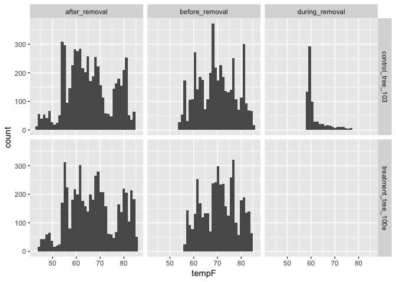
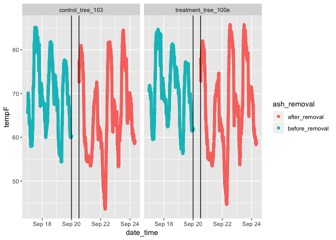

ash-microclimate-data-exploration
================
Deidre Jaeger
10/25/2018

Exploratory Data Analysis Steps
-------------------------------

*Step 1:* load data and make sure it has correct date, number, and factor classes

*Step 2:* view the histograms to see the distribution of temperatures of before and after treatments -are there any erroneous measurements?

*Step 3:* time series plot for each of the 4 sensors (x-axis = time, y axis = temperature F)

*Step 4:* combined time series plots for all 4 sensors

    ##   X           date_time tempF sensor_sn         sensor_name    ash_removal
    ## 1 1 2018-09-16 23:59:59 71.07  20439121 treatment_tree_100e before_removal
    ## 2 2 2018-09-17 00:00:59 70.91  20439121 treatment_tree_100e before_removal
    ## 3 3 2018-09-17 00:01:59 70.84  20439121 treatment_tree_100e before_removal
    ## 4 4 2018-09-17 00:02:59 70.76  20439121 treatment_tree_100e before_removal
    ## 5 5 2018-09-17 00:03:59 70.76  20439121 treatment_tree_100e before_removal
    ## 6 6 2018-09-17 00:04:59 70.84  20439121 treatment_tree_100e before_removal

    ## [1] "treatment_tree_100e" "control_tree_103"

    ## 'data.frame':    20386 obs. of  6 variables:
    ##  $ X          : int  1 2 3 4 5 6 7 8 9 10 ...
    ##  $ date_time  : chr  "2018-09-16 23:59:59" "2018-09-17 00:00:59" "2018-09-17 00:01:59" "2018-09-17 00:02:59" ...
    ##  $ tempF      : num  71.1 70.9 70.8 70.8 70.8 ...
    ##  $ sensor_sn  : int  20439121 20439121 20439121 20439121 20439121 20439121 20439121 20439121 20439121 20439121 ...
    ##  $ sensor_name: chr  "treatment_tree_100e" "treatment_tree_100e" "treatment_tree_100e" "treatment_tree_100e" ...
    ##  $ ash_removal: chr  "before_removal" "before_removal" "before_removal" "before_removal" ...

    ## 'data.frame':    20386 obs. of  6 variables:
    ##  $ X          : int  1 2 3 4 5 6 7 8 9 10 ...
    ##  $ date_time  : POSIXct, format: "2018-09-16 23:59:59" "2018-09-17 00:00:59" ...
    ##  $ tempF      : num  71.1 70.9 70.8 70.8 70.8 ...
    ##  $ sensor_sn  : Factor w/ 2 levels "20397886","20439121": 2 2 2 2 2 2 2 2 2 2 ...
    ##  $ sensor_name: Factor w/ 2 levels "control_tree_103",..: 2 2 2 2 2 2 2 2 2 2 ...
    ##  $ ash_removal: Factor w/ 3 levels "after_removal",..: 2 2 2 2 2 2 2 2 2 2 ...

``` r
ash_data %>% # define date
  ggplot() +
  geom_histogram(mapping = aes(x= tempF), bins = 40) + # define x axis
  facet_grid(facets = sensor_name ~ ash_removal) # define which variables to panel vertical and horizontal graphs with
```



``` r
ash_data %>%
  filter(ash_removal == "before_removal" | ash_removal == "after_removal") %>% 
  group_by(ash_removal) %>% 
  ggplot() +
  geom_point(mapping = aes(x = date_time, y = tempF,
                           color = ash_removal)) +
  geom_vline(xintercept = ymd_hms("2018-09-20 00:04:00")) +
  geom_vline(xintercept= ymd_hms("2018-09-20 12:20:59")) +
  facet_wrap( facets = ~ sensor_name)
```



``` r
ash_data %>%
  filter(ash_removal == "before_removal" | ash_removal == "after_removal") %>% 
  group_by(ash_removal) %>% 
  ggplot() +
  geom_line(mapping = aes(x = date_time, y = tempF,
                           color = ash_removal)) +
  geom_vline(xintercept = ymd_hms("2018-09-20 00:04:00")) +
  geom_vline(xintercept= ymd_hms("2018-09-20 12:20:59")) +
  facet_wrap( facets = ~ sensor_name)
```


